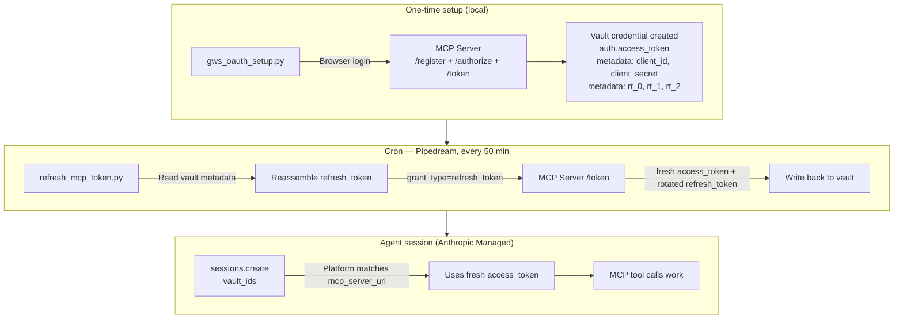

# Workspace MCP + Claude Managed Agents — Token Management

Keep Google Workspace MCP tokens alive for Claude Managed Agent sessions without manual re-authentication.

## Problem

The Anthropic vault's built-in OAuth refresh doesn't work for MCP OAuth 2.1 servers yet — it stores the refresh token but never calls `/token`. Access tokens expire after 1 hour, breaking any agent session that runs longer or starts after expiry.

## Solution

Two scripts + a cron job:

1. **`gws_oauth_setup.py`** — One-time setup. Registers a dynamic OAuth client, authenticates via browser, stores tokens in the Anthropic vault credential metadata.

2. **`refresh_mcp_token.py`** — Cron job (every 50 min). Reads the refresh token from vault metadata, refreshes it, writes back. Runs on Pipedream, GitHub Actions, or any scheduler.

## How it works



## Setup

### Prerequisites

- Anthropic API key
- A Workspace MCP Cloud instance (https://workspacemcp.com)
- An Anthropic vault (`client.beta.vaults.create(display_name="my-vault")`)

### 1. Install dependencies

```bash
pip install httpx anthropic
```

### 2. Set environment variables

```bash
export ANTHROPIC_API_KEY=sk-ant-...
export MCP_SERVER_URL=https://yourco.workspacemcp.com
export ANTHROPIC_VAULT_ID=vlt_01...
```

### 3. Run the one-time setup

```bash
python3 gws_oauth_setup.py
```

This opens a browser for Google login, then creates the vault credential.

### 4. Set up the cron

**Pipedream (recommended):**
- Create a scheduled workflow (every 50 minutes)
- Add a Python step, paste `refresh_mcp_token.py`
- Set `ANTHROPIC_API_KEY`, `MCP_SERVER_URL`, `VAULT_ID` as Pipedream env vars

**Or crontab:**
```
*/50 * * * * cd /path/to/scripts && python3 refresh_mcp_token.py >> /tmp/mcp_refresh.log 2>&1
```

### 5. Create agent sessions with the vault

```python
session = client.beta.sessions.create(
    agent=agent_id,
    environment_id=env_id,
    vault_ids=["vlt_01..."],  # your vault ID
)
```

The platform matches the credential's `mcp_server_url` to the agent's MCP server config automatically.

## Key details

- **Refresh tokens rotate** on every use (single-use). The cron saves the new one each time.
- **Refresh tokens last 30 days.** As long as the cron runs, they stay alive indefinitely.
- **Vault metadata values cap at 512 chars.** The refresh token JWT (~1,344 chars) is split across `rt_0`, `rt_1`, `rt_2` keys.
- **Mid-run refresh works.** Updating the vault credential while a session is running gets picked up by subsequent MCP calls in that session.
- **Only one process should refresh at a time.** If both a cron and a launch script refresh, the first one's rotated token invalidates the second's. Let the cron own it.
